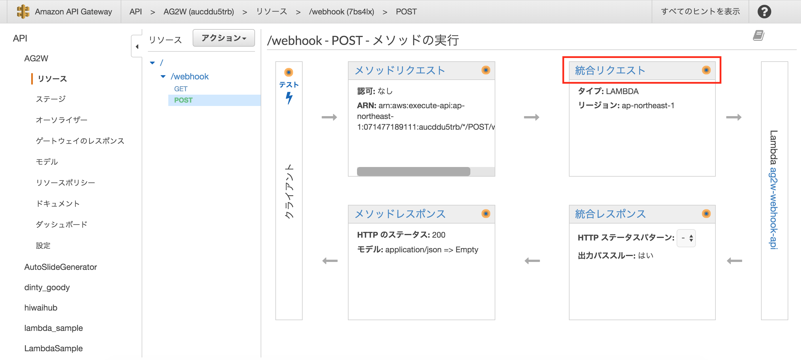
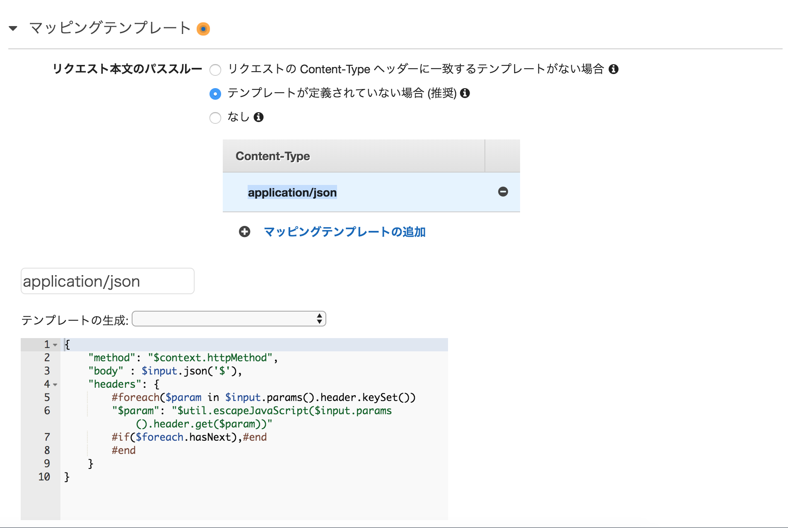

## 技術的なメモ

### Asana APIのWebhook

NodejsのAsanaライブラリを用いてWebhookを飛ばすには以下のようなリクエストを設定する

```
await client.webhooks.create("projectId or taskId", "webhook url")
```

上記を実行するとWebhook URLにPOSTリクエストが送信される。そのリクエストのヘッダーの中に`X-Hook-Secret`のフィールドがあり、その値を用いて、Asanaと認証することでWebhookの登録を行う。

【参考】
* [Asana Developers Webhooks](https://asana.com/developers/api-reference/webhooks)

### AWS API Gatewayで受け取ったヘッダーとかをLambdaに流す

Lambdaで送られてHeaderを受け取るにはAPIGatewayのマッピングテンプレートを修正する必要がある。



まずはAPIGatewayから我当のパスの設定に行く



次にマッピングテンプレートの `Content-Type` の設定に `application/json` を追加し、マッピングテンプレートに以下の内容を追記する。

```
{
    "method": "$context.httpMethod",
    "body" : $input.json('$'),
    "headers": {
        #foreach($param in $input.params().header.keySet())
        "$param": "$util.escapeJavaScript($input.params().header.get($param))"
        #if($foreach.hasNext),#end
        #end
    }
}
```

こうすることで、LambdaにHeaderの値を受け渡すことができる。

【参考】
* [カスタムの Lambda 統合を使用して、どのように Amazon API Gateway から AWS Lambda 関数にカスタムヘッダーを渡して処理することができますか?
](https://aws.amazon.com/jp/premiumsupport/knowledge-center/custom-headers-api-gateway-lambda/)